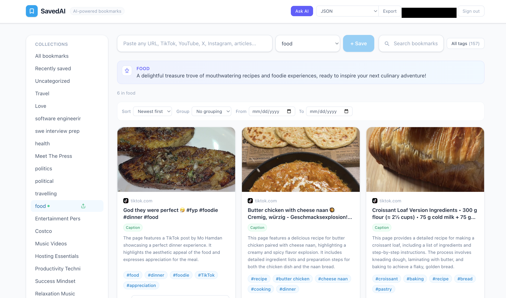
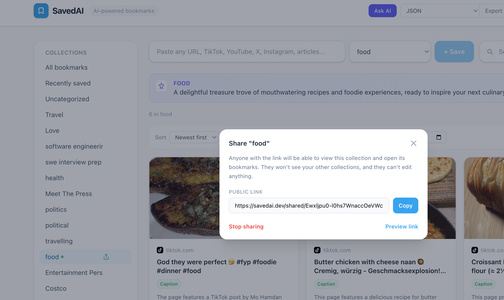
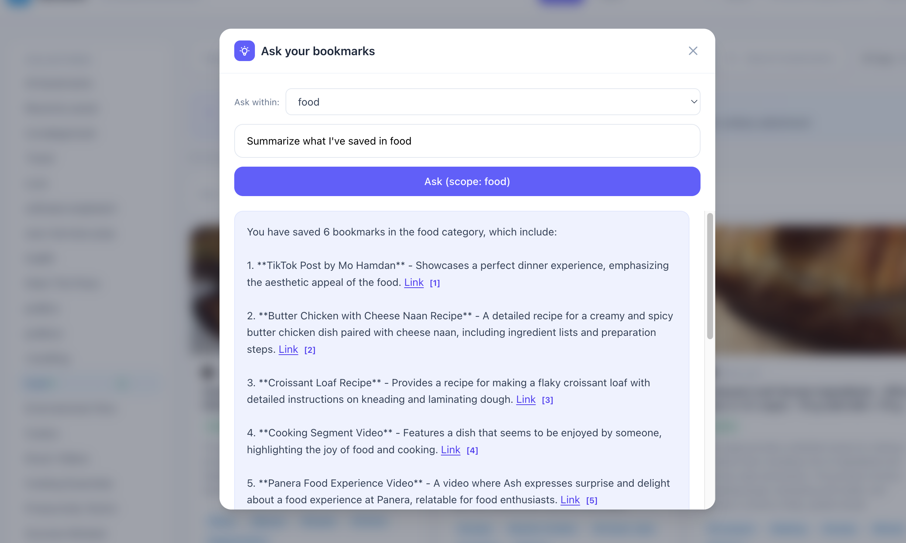
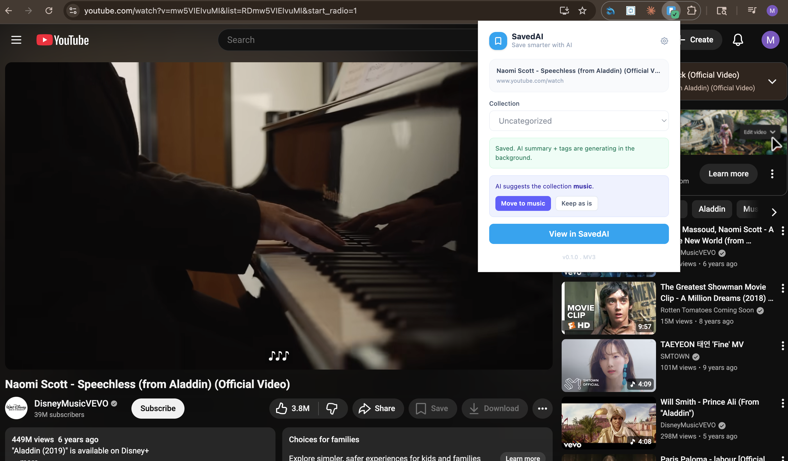

# SavedAI

An AI-powered bookmark manager for the modern web. Paste any link (article, YouTube, TikTok, Instagram, X, GitHub, anything) and SavedAI fetches the page, extracts the body or transcript, generates a two-sentence summary plus tags with GPT-4o-mini, and routes it into the right collection automatically. Search semantically across everything you've saved, ask natural-language questions about your library, and share read-only collection links with anyone.



## What it does

Paste a URL. SavedAI scrapes the page, runs it through one of three content extractors depending on the source (YouTube captions via the youtube-transcript-api, full article body via trafilatura, or oEmbed caption text for TikTok and Instagram), then asks GPT-4o-mini for a concise two-sentence summary and three to five tags. The same content is run through `text-embedding-3-small` for semantic search.

A separate AI pass classifies the new bookmark against your existing collections using the embeddings: if it confidently belongs in something you already have, it suggests moving it; if it looks like a new theme, it proposes creating a fresh collection. You can accept, reject, or override every suggestion.

The "Ask AI" feature scopes a question to all bookmarks, a specific collection, or just Uncategorized, then runs retrieval over the embeddings and generates an answer with citations back to the original sources.



## Tech stack

| Layer | Choice | Why |
|---|---|---|
| Backend | FastAPI + SQLAlchemy 2 + Uvicorn | Type-safe, async-friendly, great auto-generated OpenAPI docs |
| Database | PostgreSQL on Neon (serverless) | Scales to zero, branching for free tier, generous storage |
| AI | OpenAI `gpt-4o-mini` + `text-embedding-3-small` | Best cost/quality ratio; mini handles summary/classification at fractions of a cent per save |
| Vector search | FAISS in-process with keyword fallback | Fast enough for thousands of bookmarks per user without a separate vector DB |
| Auth | JWT (HS256) + bcrypt via passlib | Stateless tokens, 60-minute lifetime, password reset via Resend |
| Frontend | React 19 + Vite + Tailwind CSS v4 | Fast HMR, no router needed for a tight surface area, utility-first styling |
| Extension | Manifest V3, CRXJS + Vite, React popup | Same React stack as the web app; service worker handles context menu and badge |
| Hosting | Render (backend), Cloudflare Workers Static Assets (frontend) | Free tiers, region pinning, custom domain, no Vercel |
| Email | Resend | Password reset emails; falls back to console logging in dev |

## Architecture decisions worth talking about

**One unified ingest pipeline regardless of source.** YouTube, articles, and social posts all flow through the same `metadata.py` and `transcript.py` modules. The extractors are tried in source-aware order (YouTube captions for video, trafilatura for articles, oEmbed for social) and the result feeds the same summarizer prompt. Adding a new source means adding one extractor, not a new code path.

**AI-suggested collection classifier.** When a bookmark is saved, an embedding is computed and compared against the centroid of each existing collection. If cosine similarity to the closest collection is above a threshold, the user gets a "Move to X?" prompt. If nothing matches, GPT proposes a new collection name. This is what makes the product feel automatic without removing user agency.

**SSRF-hardened scraper and image proxy.** Every outbound fetch of a user-supplied URL passes through `is_safe_public_url`, which resolves DNS and rejects hostnames that map to loopback, link-local, private, or reserved IP ranges. This prevents a crafted bookmark from making the backend hit `169.254.169.254` (AWS metadata) or internal services. Documented TOCTOU limitation: DNS rebinding is a known small window we accept on the free tier.

**Production-only secret guards.** The config layer refuses to boot in production with the placeholder JWT secret or local DATABASE_URL still set. This is a small thing that has saved every team I've worked on at least one Friday afternoon.

**Strict Content-Security-Policy on the API.** `default-src 'none'; frame-ancestors 'none'` on every JSON response, with an explicit allowlist for `/docs` and `/redoc` so Swagger UI can still load its assets. Plus standard hardening headers (`X-Content-Type-Options`, `Referrer-Policy`, `Permissions-Policy`, HSTS in production only).

**Rate limits everywhere user input lands.** slowapi caps `/auth/register`, `/auth/forgot-password`, `/proxy-image`, `/search`, `/ask`, `/export`, `/bookmarks` (POST) and a few others by user ID when authenticated and by IP when not. Tunable per-endpoint.

**Defensive output caps on AI responses.** The summarizer prompt asks for two sentences, but a prompt-injected page can't bloat a DB row because every returned summary is clipped to 1000 chars and every tag to 50.



## Features

- Save any URL (article, video, social post)
- Automatic title, description, thumbnail extraction
- Two-sentence AI summary plus 3 to 5 tags per bookmark
- YouTube transcript and article body extraction so summaries are based on what the page actually says, not just the title
- Collections with rename, delete, and per-collection AI-generated descriptions
- AI-suggested collection routing on save and category-mismatch warnings
- Semantic search across summaries, titles, transcripts, and tags
- "Ask your bookmarks" with collection scoping and source citations
- Public read-only share links per collection
- Export to JSON, CSV, Markdown, HTML (browser-importable), TXT, and PDF
- Forgot-password flow via Resend email
- Mobile-friendly responsive layout with collections drawer
- Chrome extension: save current tab from popup, right-click to save any link, keyboard shortcut, settings panel for API URL override, badge that shows when the current page is already saved



## Project layout

```
savedai/
  backend/
    app/
      main.py            # FastAPI routes, middleware, rate limits
      auth.py            # JWT, password hashing, reset tokens
      ai.py              # OpenAI summary + tag generation
      ask.py             # Retrieval + answer generation
      search.py          # FAISS + keyword search
      metadata.py        # Title/description/image extraction
      transcript.py      # YouTube + article + social caption extraction
      url_safety.py      # SSRF prevention helper
      email.py           # Resend integration
      config.py          # pydantic-settings with prod guards
      models.py / schemas.py / database.py
    requirements.txt
  frontend/
    src/
      App.jsx            # Main authenticated layout
      components/
        AuthPage.jsx
        LandingPage.jsx
        BookmarkCard.jsx
        CollectionsSidebar.jsx
        AskModal.jsx
        ShareModal.jsx
        ExportMenu.jsx
        ...
      api/               # Axios clients
      contexts/AuthContext.jsx
  extension/
    src/
      popup/             # React popup
      background/        # MV3 service worker
      lib/               # api + storage helpers
    manifest.config.js
    scripts/pack.mjs     # Cross-platform zip for Web Store
  docs/screenshots/
  wrangler.jsonc         # Cloudflare config for the frontend
```

## Running locally

You need Python 3.11+, Node 20+, Postgres 17, an OpenAI API key, and (optionally) a Resend API key.

```bash
# Backend
cd backend
python -m venv .venv && source .venv/bin/activate
pip install -r requirements.txt
cp .env.example .env   # fill in DATABASE_URL, OPENAI_API_KEY, JWT_SECRET_KEY
uvicorn app.main:app --reload --port 8001

# Frontend
cd frontend
npm install
echo 'VITE_API_URL=http://localhost:8001' > .env.local
npm run dev   # http://localhost:3000

# Extension
cd extension
npm install --legacy-peer-deps
npm run dev   # then load extension/dist via chrome://extensions Load unpacked
```

## Deployment

Frontend is a Vite static build deployed via Cloudflare Workers Static Assets (`wrangler.jsonc` at repo root). Backend is a FastAPI app on Render, free tier, auto-deploying from `main`. Database is Neon (Postgres 17, serverless, US-West-2). Email goes through Resend. The Chrome extension is packed by `npm run pack` in `extension/`, producing a versioned zip for the Web Store.

DNS: `savedai.dev` → Cloudflare Pages, `savedai-api.onrender.com` → Render. CORS allowlist on the backend includes the production frontend origin and a regex for `chrome-extension://` so any installed extension instance can call the API.

## License

MIT.
